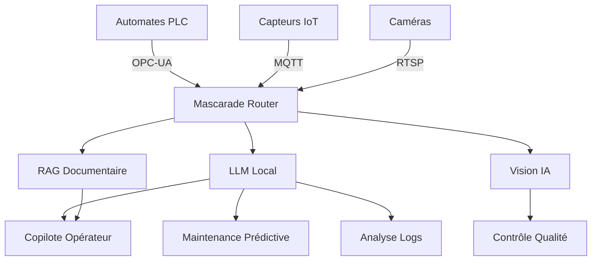

# Factory 4.0 — IA Industrielle Open Source

## L'Electron Rare

---

## Slide 1 — Le constat

- 73% des PME industrielles n'exploitent pas leurs données machines
- Les opérateurs passent 30% de leur temps à chercher de l'information
- La maintenance curative coûte 5x plus cher que la maintenance prédictive

---

## Slide 2 — Notre proposition

**IA industrielle 100% open source, déployée sur site**

- Souveraineté totale des données (RGPD natif)
- Pas de dépendance cloud ni de licence récurrente
- Modèles IA de pointe exécutés localement

---

## Slide 3 — Architecture

---

## Slide 4 — Stack technique

| Composant | Technologie | Licence |
|-----------|------------|---------|
| Routeur LLM | Mascarade | Open source |
| Modèles IA | Mistral, Qwen, devstral | Open weights |
| Base vectorielle | Qdrant | Open source |
| Monitoring | Grafana + InfluxDB | Open source |
| Vision | YOLOv8 + SAM2 | Open source |
| Connecteurs | MCP OPC-UA/MQTT | Open source |

---

## Slide 5 — Cas d'usage

1. **Copilote opérateur** — Chatbot interrogeant données machines en langage naturel
2. **Maintenance prédictive** — Anticiper les pannes par analyse de tendances
3. **Contrôle qualité** — Détection défauts par vision temps réel
4. **Analyse logs** — Rapports automatiques depuis les logs MES/ERP
5. **Formation** — Procédures générées depuis l'historique

---

## Slide 6 — 3 offres

| | Starter | Pro | Enterprise |
|---|---------|-----|------------|
| Copilote opérateur | ✅ | ✅ | ✅ |
| RAG docs machines | ✅ | ✅ | ✅ |
| Maintenance prédictive | | ✅ | ✅ |
| Connexion OPC-UA/MQTT | | ✅ | ✅ |
| Dashboards Grafana | | ✅ | ✅ |
| Vision industrielle | | | ✅ |
| Intégration MES | | | ✅ |
| Formation auto | | | ✅ |
| **Durée** | **5-10j** | **15-25j** | **30-50j** |

---

## Slide 7 — Références techniques

- 5 machines déployées en production (Tower, KXKM RTX 4090, Photon, CILS, Local)
- 99 modèles Ollama disponibles
- 10 serveurs MCP (KiCad, OPC-UA, MQTT, Apify...)
- 24 agents IA spécialisés
- Agentic RAG avec re-routage intelligent

---

## Slide 8 — Contact

**L'Electron Rare**
- Web : lelectronrare.fr
- Mail : contact@lelectronrare.fr
- GitHub : github.com/electron-rare
- Ops : ops.saillant.cc

*Ingénierie électronique + IA embarquée + Formation*
