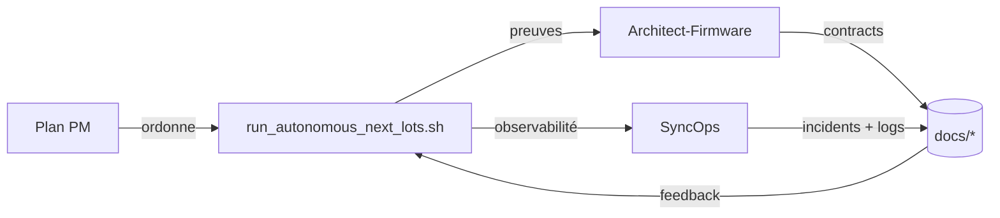

# 12) Plan de gestion des agents

Last updated: 2026-03-22

Ce document pilote la gouvernance agentique et les 3 plans opérationnels: **PM**, **Architect-Firmware** et **SyncOps**.

Matrice explicite specs/modules -> agents dédiés: `docs/AGENT_SPEC_MODULE_MATRIX_2026-03-20.md`

## Consolidation 2026-03-21 - extensions d'abord

La passe active retient `kill-life-studio` comme produit pilote. `kill-life-mesh` et `kill-life-operator` n'ouvrent pas de spécialisation profonde tant que le socle `projet actif + grounding + tests` n'est pas validé dans Studio.

| Lead | Sous-agents | Compétences | Backlog initial |
| --- | --- | --- | --- |
| `PM-Mesh` | `Plan-Orchestrator`, `Risk-Triager`, `Release-Gate` | arbitrage, backlog, release gate | baseline sale, P0/P1, critères de "prêt avant public" |
| `Docs-Research` | `Doc-Entry`, `Mermaid-Map`, `Feature-Map`, `Runbook-Editor` | consolidation doc, benchmark, cartes | `README`, `docs/index`, `tools/cockpit/README`, `specs/README`, audit unique |
| `Studio-Product` | `UX-Lead`, `Context-Builder`, `Artifact-Model`, `Extension-Test` | UX auteur, contexte chat, artefacts, tests | projet actif, workflow `brief -> spec -> decisions -> AC -> plan`, tests unitaires et extension-host |
| `Mesh-Contracts` | `Handoff-Guard`, `Contract-View`, `Dependency-Mapper` | contrats, handoffs, ownership | reprendre le socle Studio validé puis spécialiser les vues multi-repo |
| `Operator-Lane` | `Runbook-Guard`, `Evidence-Runner`, `Log-Ops` | runbooks, preuves, exécution | reprendre le socle Studio validé puis spécialiser checks et evidence |
| `Runtime-Companion` | `MCP-Health`, `Prompt-Eval`, `Bridge-Queue` | santé runtime/MCP, dégradation maîtrisée, prompt eval | gateway canonique `ready/degraded/blocked` via `runtime_ai_gateway.sh` |
| `QA-Compliance` | `Contract-Tests`, `Shell-Harness`, `Smoke-E2E` | tests shell/TUI, contrats JSON, smoke VSIX | stable suite Python, tests cockpit ciblés, `runtime_ai_gateway.sh`, smoke multi-root |
| `OSS-Watch` | `VSCode-Agent-Benchmark`, `Agent-Framework-Benchmark`, `MCP-Benchmark` | veille web et décisions d'adoption | benchmark unique Roo Code / OpenHands / LangGraph / MCP |

## Delta 2026-03-21 - lane intelligence program

- Le lot dedie `22` ouvre une surface cockpit propre:
  - `tools/cockpit/intelligence_tui.sh`
  - `docs/plans/22_plan_integration_intelligence_agentique.md`
  - `docs/plans/22_todo_integration_intelligence_agentique.md`
- La passerelle courte au-dessus de cette lane est:
  - `tools/cockpit/runtime_ai_gateway.sh`
- Cette surface publie aussi une memoire exploitable:
  - `artifacts/cockpit/intelligence_program/latest.json`
  - `artifacts/cockpit/intelligence_program/latest.md`
- Owner principal de la surface:
  - `QA-Compliance / Shell-Harness / Contract-Tests` pour la TUI, les logs et le contrat JSON
- Owner principal de la continuite documentaire:
  - `Docs-Research / Doc-Entry / Mermaid-Map` pour la spec, la feature map et la veille 2026
- Routine recommandee pour `PM-Mesh`, `Docs-Research` et `QA-Compliance`:
  - `bash tools/cockpit/lot_chain.sh status`
  - `bash tools/cockpit/intelligence_tui.sh --action status --json`
  - `bash tools/cockpit/intelligence_tui.sh --action next-actions`
  - `bash tools/cockpit/intelligence_tui.sh --action memory --json`
  - `bash tools/cockpit/runtime_ai_gateway.sh --action status --refresh --json`

## Delta 2026-03-22 - lane web Git EDA + intelligence

- Le lot intelligence couvre maintenant explicitement le backlog `web/` et le `plan 23`.
- Le binome d'audit lecture seule utilise dans cette passe:
  - `Hilbert` -> audit contrats/spec/plan/TUI intelligence
  - `Huygens` -> audit `web/` Git EDA, GraphQL, realtime, queue et workers
- Owners canoniques de la slice `web/`:
  - `Web-CAD-Platform` -> `Project-Service`, `Product-Web`, `Review-Assist`
  - `Realtime-Collab` -> `Yjs-Bridge`, `Presence-Transport`
  - `EDA-CI-Orchestrator` -> `Worker-Runner`, `Artifacts-Bridge`
- Skills a privilegier sur cette lane:
  - `bash-cli-tui` pour les TUIs et contrats shell
  - `playwright` pour les checks UI reels quand requis
  - `openai-docs` pour les integrations officielles OpenAI quand la lane review-assist s'ouvre
- Routine recommandee pour cette lane:
  - `bash tools/cockpit/intelligence_tui.sh --action status --json`
  - `bash tools/cockpit/intelligence_tui.sh --action next-actions`
  - `bash tools/cockpit/yiacad_operator_index.sh --action status`
  - `bash tools/cockpit/runtime_ai_gateway.sh --action status --refresh --json`

## Carte opérationnelle des 3 plans

| Plan | Lead | Sous-agents actifs | Compétences | Mission de lot | Prochaine action |
| --- | --- | --- | --- | --- | --- |
| PM | `PM-Mesh` | `PM-Plan`, `PM-Choix`, `PM-Doc` | Orchestration lot, preuve JSON, arbitrage P0-P2 | piloter `run_autonomous_next_lots` | Lancer `yiacad-fusion` dès stabilisation du prérequis runtime |
| Architect-Firmware | `Arch-Mesh` | `Runtime-Companion`, `Schema-Guard`, `Embedded-CAD`, `Firmware` | robustesse ready/degraded/blocked, host-first CAD, intégrations IA-native | sécuriser lanes MCP/CAD + préflight mesh | finaliser `yiacad-fusion` (prepare→smoke→status) |
| SyncOps | `SyncOps` | `SSH-Health`, `Log-Ops`, `Doc-Runbook` | SSH, TUI, logs, incidents | piloter load-balancing P2P et registre d’incidents | clôturer le backlog `mesh` + purge TTL quotidienne contrôlée |
| DesignOps-UI | `UX-Lead` | `Apple-HIG`, `CAD-UX`, `UI-Research`, `TUI-Ops` | Apple HIG, UI architecture macOS, surfaces KiCad/FreeCAD, TUI opératoire | piloter la refonte UI/UX YiACAD Apple-native | passer du plugin/workbench Python au shell natif compilé et aux commandes IA contextualisées |

## Labels recommandés

- `type:agentics`
- `ai:plan`
- `ai:hold`
- `priority:p0/p1/p2`

## Référentiel multi-plans

| Plan | Responsable | Sous-agents | Compétences | Missions clés |
| --- | --- | --- | --- | --- |
| PM | `PM-Mesh`, `PM-Plan`, `PM-Choix` | coordination lot, priorité, arbitrage, preuves | `specs/04_tasks.md`, `docs/plans/18_plan_enchainement_*`, `docs/plans/19_todo_mesh_tri_repo.md` | cycle lot, dépendances, revue produit |
| Architect-Firmware | `Arch-Mesh`, `Runtime-Companion`, `Embedded-CAD`, `Firmware` | architecture, contracts, runtime, robustesse | `docs/AGENTIC_LANDSCAPE.md`, `docs/REFACTOR_MANIFEST_2026-03-20.md`, `tools/autonomous_next_lots.py`, `tools/hw/*`, `tools/cockpit/mesh_sync_preflight.sh` | robustesse `ready/degraded/blocked`, host-first CAD |
| SyncOps | `SyncOps`, `SSH-Health`, `Log-Ops` | SSH, observabilité, logs, purge | `tools/cockpit/ssh_healthcheck.sh`, `tools/cockpit/run_alignment_daily.sh`, `tools/cockpit/log_ops.sh`, `tools/cockpit/mesh_sync_preflight.sh`, `tools/cockpit/mesh_health_check.sh`, `docs/MACHINE_ALIGNMENT_CONTRACT_2026-03-20.md` | alignment 4 cibles + incidents réseau/runtime |

## Plan 1 — PM (pilotage + lot)

### Objectifs

- Détecter les lots utiles (`run_autonomous_next_lots`), exécuter en cycle standard et tenir la preuve.
- Valider la matrice **lot → owner → dépendances → rollback**.
- Gérer les priorités P0/P1/P2 et la revue quotidienne.

### I/O attendues

- `bash tools/run_autonomous_next_lots.sh status`
- `bash tools/run_autonomous_next_lots.sh run`
- `bash tools/run_autonomous_next_lots.sh json`
- `tools/autonomous_next_lots.py` doit produire `18_plan_enchainement_autonome_des_lots_utiles.md` et `18_todo_enchainement_autonome_des_lots_utiles.md`.

### Priorités

- P0: stabiliser `post-e2e-hardening`, restaurer `clems` dans le preflight, puis reprendre `zeroclaw-integrations`.
- P1: corriger les lots `mcp-runtime` et `cad-mcp-host`.
- P2: finaliser `python-local` après stabilité runtime.

## Plan 2 — Architect / Firmware

### Objectifs

- Finaliser intégration runtime IA-native et lanes de robustesse.
- Stabiliser scripts MCP/CAD en mode `host-first` avec fallback maîtrisé.
- Assurer cohérence des contrats dans `docs/*` et `specs/*`.

### I/O attendues

- `bash tools/ai/zeroclaw_integrations_lot.sh verify --json`
- `bash tools/ai/zeroclaw_integrations_up.sh --json`
- `bash tools/ai/zeroclaw_integrations_status.sh --json`
- `bash tools/ai/zeroclaw_integrations_import_n8n.sh --json`
- `bash tools/hw/cad_stack.sh doctor`
- `bash tools/hw/run_kicad_mcp.sh --doctor`

### Priorités

- P0: consolider le bridge `Full operator lane` en mode container-safe et degraded-safe.
- P1: finaliser `mcp-runtime` et `cad-mcp-host`.
- P2: verrouiller la stratégie Python repo-locale.

## Plan 3 — SyncOps

### Objectifs

- Assurer la convergence des 4 cibles SSH.
- Appliquer la politique de charge P2P (`tower-first` / `photon-safe`) sur les préchecks mesh pour éviter de forcer les services sur `cils`.
- Centraliser health-check, logs (analyse + purge), préflight mesh, et registre d'incidents.
- Alimenter la mémoire d'exécution avec preuves JSON.

### I/O attendues

- `bash tools/cockpit/ssh_healthcheck.sh --json`
- `bash tools/cockpit/mascarade_runtime_health.sh --json`
- `bash tools/cockpit/run_alignment_daily.sh --json [--skip-healthcheck]`
- `bash tools/cockpit/mesh_sync_preflight.sh --json`
- `bash tools/cockpit/log_ops.sh --action summary|list|purge --json`
- `bash tools/cockpit/mesh_health_check.sh --json --load-profile [tower-first|photon-safe]`
- `bash tools/cockpit/refonte_tui.sh --action mesh-preflight`

### Priorités

- P0: confirmer l'opérateur daily sur 4 cibles et restaurer la visibilité preflight de `clems`.
- P0: maintenir `cils` hors charges essentielles (`Kill_LIFE` prioritaire, pas de service durable sur photon).
- P1: tenir la matrice `logs` (summary/list/purge) + TTL.
- P2: documenter les incidents réseau/runtime dans le registre.
- P0: vérifier la convergence du load-balancing P2P `Tower -> KXKM -> CILS -> local -> root` à chaque run.

## Registre d'incidents réseau/runtime

- Voir: `docs/MESH_SYNC_INCIDENT_REGISTER_2026-03-20.md`
- Format: horodatage / cible / couche / statut / preuve / ETA / propriétaire.

## Rôles actifs

1. `PM-Mesh` / `PM-Plan`
2. `Arch-Mesh` / `Schema-Guard`
3. `Embedded-CAD` / `CAD-Intégration`
4. `Runtime-Companion` / `Runtime-Smoke`
5. `SyncOps` / `Log-Ops`
6. `Doc-Runbook`

## Couverture explicite specs/modules

- Chaque specification et chaque module operatoire majeur ont maintenant un agent pilote, un sous-agent, un `write_set` et une sortie attendue.
- La matrice de reference est publiee dans `docs/AGENT_SPEC_MODULE_MATRIX_2026-03-20.md`.
- Les skills locales a privilegier sur les surfaces outillees restent: `bash-cli-tui` pour les scripts shell/TUI, `playwright` pour les verifications UI reelles, `openai-docs` pour les integrations officielles OpenAI quand elles deviennent necessaires.
- Passe structurante en cours: `mesh_sync_preflight` consomme maintenant le registre machine/capacite comme source de verite runtime; prochaine extension cible `ssh_healthcheck`, `run_alignment_daily` et les derniers chemins repo candidats.

## Checkpoint (résumé)

- `T-MESH-001` : contrat mesh tri-repo versionné — aligné
- `T-MESH-002` : preflight `ready/degraded/blocked` — aligné
- `T-MESH-003` : ownership `owner_repo / owner_agent` — aligné
- `T-MESH-005` : propagation `mascarade` — en cours
- `T-MESH-006` : handshake `crazy_life` — en cours
- `T-RE-001` / `T-RE-105` : plans + compétences — en exécution
- `T-OL-001` : full operator lane valide sur `clems` — aligné
- `T-OL-002` : propagation + restauration preflight `clems` — en cours
- `T-OL-002` : propagation + restauration preflight `clems` — aligne
- `T-OL-003` : note de compatibilité provider/runtime — aligné
- `T-OL-004` : TUI de sync du patchset opérateur — aligné

### Lot CAD (inclus dans Architect-Firmware)

### Objectifs

- Intégrer YiACAD dans le lot Architect-Firmware sans altérer la charge sur `cils`/`photon`.
- Conserver les forks locales et distants de KiCad/FreeCAD en mode isolé `kill-life-ai-native`.
- Produire des artefacts de santé CAD auditables et une procédure de rollback claire, avec priorité à la stabilité de la couche runtime.

### I/O attendues

- `bash tools/cad/yiacad_fusion_lot.sh --action prepare`
- `bash tools/cad/yiacad_fusion_lot.sh --action smoke`
- `bash tools/cad/yiacad_fusion_lot.sh --action status`
- `bash tools/cad/yiacad_fusion_lot.sh --action logs`
- `bash tools/cockpit/refonte_tui.sh --action yiacad-fusion:prepare`
- `bash tools/cockpit/refonte_tui.sh --action yiacad-fusion:smoke`

### Priorités

- P0: garder `prepare` + `status` + `logs` + `clean-logs` stables, avec un blocage KiCad host explicite et traçable.
- P1: maintenir les preuves/logs à jour dans `specs/04_tasks.md` et `docs/CAD_AI_NATIVE_FORK_STRATEGY.md`.
- P2: sécuriser la réconciliation des forks distants et le fallback container.
- `T-CAD-001` : lot YiACAD intégré — implémenté/documenté, lane runtime encore `blocked` côté KiCad host

## Affectation active des lots ouverts

| Tâche / lot | Agent pilote | Sous-agent | Compétences / skills | Write set principal |
| --- | --- | --- | --- | --- |
| `T-RE-204` / `zeroclaw-integrations` | `PM-Mesh` | `Runtime-Smoke` | triage lot, runtime local, `bash-cli-tui` | `specs/zeroclaw_dual_hw_todo.md`, `tools/cockpit/lot_chain.sh`, `tools/cockpit/run_next_lots_autonomously.sh` |
| `mesh-governance` | `PM-Mesh` | `Schema-Guard` | contrats mesh, handoff, preuve CI | `docs/TRI_REPO_MESH_CONTRACT_2026-03-20.md`, `docs/plans/19_todo_mesh_tri_repo.md`, `tools/cockpit/mesh_sync_preflight.sh` |
| `T-RE-215` / `mascarade-model-profiles` | `Runtime-Companion` | `Provider-Bridge` | routing provider/model, profils runtime, `bash-cli-tui` | `specs/contracts/mascarade_model_profiles.kxkm_ai.json`, `tools/cockpit/mascarade_models_tui.sh`, `tools/ops/operator_live_provider_smoke.py`, `tools/ops/sync_mascarade_agents_kxkm.sh` |
| `T-RE-218` / `mascarade-ollama-live` | `Runtime-Companion` | `Provider-Bridge` | bridge Ollama local, compat runtime, profils `ollama-first`, `bash-cli-tui` | `specs/contracts/mascarade_model_profiles.kxkm_ai.json`, `docs/MASCARADE_MODEL_PROFILES_KXKM_AI_2026-03-20.md`, `tools/ops/sync_mascarade_agents_kxkm.sh` |
| `T-RE-219` / `mascarade-agent-smoke` | `Runtime-Companion` | `Runtime-Smoke` | smoke API live, artefacts JSON, validation ciblee | `tools/ops/smoke_mascarade_agents_kxkm.sh`, `artifacts/ops/mascarade_agent_smoke/*`, `docs/MASCARADE_MODEL_PROFILES_KXKM_AI_2026-03-20.md` |
| `T-RE-221` / `mascarade-ui-presets` | `Runtime-Companion` | `UI-Dispatch` | presets UI, registre agents, publication front | `/home/kxkm/mascarade-main/web/src/pages/Agents.tsx`, `docs/MASCARADE_MODEL_PROFILES_KXKM_AI_2026-03-20.md` |
| `T-RE-222` / `mascarade-runtime-health` | `SyncOps` | `Runtime-Smoke` | health live, Ollama, JSON cockpit, runbook daily | `tools/cockpit/mascarade_runtime_health.sh`, `tools/cockpit/run_alignment_daily.sh`, `tools/cockpit/README.md` |
| `T-RE-223` / `oss-chat-presets-research` | `PM` | `Research-Curator` | veille web, chats multi-agents, personas, orchestration | `docs/WEB_RESEARCH_OPEN_SOURCE_2026-03-20.md`, `specs/04_tasks.md` |
| `T-RE-224` / `operator-runtime-health-surface` | `SyncOps` | `TUI-Ops` | TUI cockpit, lane operateur, contrat JSON, `bash-cli-tui` | `tools/cockpit/full_operator_lane.sh`, `tools/cockpit/refonte_tui.sh`, `tools/cockpit/README.md` |
| `T-RE-225` / `mascarade-logs-tui` | `SyncOps` | `Log-Curator` | logs runtime, purge contrôlée, TUI cockpit, `bash-cli-tui` | `tools/cockpit/mascarade_logs_tui.sh`, `tools/cockpit/refonte_tui.sh`, `tools/cockpit/full_operator_lane.sh`, `tools/cockpit/README.md` |
| `T-RE-226` / `operator-mascarade-logs-bridge` | `SyncOps` | `Lane-Guard` | lane operateur, logs runtime, hints API, `bash-cli-tui` | `tools/cockpit/full_operator_lane.sh`, `tools/cockpit/mascarade_logs_tui.sh`, `specs/04_tasks.md` |
| `T-RE-227` / `operator-native-logs-mode` | `SyncOps` | `Lane-Guard` | lane operateur, logs natifs, hints API, `bash-cli-tui` | `tools/cockpit/full_operator_lane.sh`, `tools/cockpit/README.md`, `specs/04_tasks.md` |
| `T-RE-228` / `operator-logs-tui-reroute` | `SyncOps` | `TUI-Ops` | TUI cockpit, lane operateur, contrat JSON, `bash-cli-tui` | `tools/cockpit/refonte_tui.sh`, `tools/cockpit/full_operator_lane.sh`, `tools/cockpit/README.md` |
| `T-RE-229` / `operator-logs-shortcuts` | `SyncOps` | `TUI-Ops` | TUI cockpit, raccourcis logs, ergonomie operateur, `bash-cli-tui` | `tools/cockpit/refonte_tui.sh`, `tools/cockpit/README.md`, `specs/04_tasks.md` |
| `T-RE-230` / `operator-post-run-log-snapshot` | `SyncOps` | `Lane-Guard` | lane operateur, snapshot latest, artefacts runtime, `bash-cli-tui` | `tools/cockpit/full_operator_lane.sh`, `specs/04_tasks.md`, `tools/cockpit/README.md` |
| `T-RE-231` / `daily-mascarade-log-snapshot` | `SyncOps` | `Doc-Runbook` | routine daily, logs runtime, synthèse opératoire, `bash-cli-tui` | `tools/cockpit/run_alignment_daily.sh`, `tools/cockpit/README.md`, `specs/04_tasks.md` |
| `T-RE-232` / `mascarade-incident-brief` | `PM` | `Doc-Runbook` | markdown opératoire, incidents runtime, handoff quotidien | `tools/cockpit/render_mascarade_incident_brief.sh`, `tools/cockpit/run_alignment_daily.sh`, `specs/04_tasks.md` |
| `T-RE-233` / `mascarade-incident-registry` | `PM` | `Doc-Runbook` | registre incidents, historique horodaté, handoff agentique | `tools/cockpit/mascarade_incident_registry.sh`, `artifacts/cockpit/*`, `specs/04_tasks.md` |
| `T-RE-234` / `weekly-mascarade-ops-embed` | `SyncOps` | `Doc-Runbook` | synthèse hebdo, brief incident, registre, `bash-cli-tui` | `tools/cockpit/render_weekly_refonte_summary.sh`, `tools/cockpit/render_mascarade_incident_brief.sh`, `tools/cockpit/mascarade_incident_registry.sh` |
| `T-RE-235` / `mascarade-observability-research` | `PM` | `Research-Curator` | veille OSS, observabilité légère, incidents, status pages | `docs/WEB_RESEARCH_MASCARADE_OBSERVABILITY_2026-03-21.md`, `specs/04_tasks.md` |
| `T-RE-236` / `daily-operator-summary-mascarade` | `SyncOps` | `Doc-Runbook` | synthèse quotidienne, handoff opérateur, markdown/json | `tools/cockpit/render_daily_operator_summary.sh`, `tools/cockpit/run_alignment_daily.sh`, `specs/04_tasks.md` |
| `T-RE-237` / `mascarade-ops-feature-map` | `PM` | `Doc-Runbook` | feature map Mermaid, cartographie agents, roadmap ops | `docs/MASCARADE_OPS_OBSERVABILITY_FEATURE_MAP_2026-03-21.md`, `specs/04_tasks.md` |
| `T-RE-238` / `operator-daily-summary-bridge` | `SyncOps` | `Lane-Guard` | lane operateur, synthèse quotidienne, contrat JSON | `tools/cockpit/full_operator_lane.sh`, `tools/cockpit/render_daily_operator_summary.sh`, `specs/04_tasks.md` |
| `T-RE-239` / `incident-registry-severity-map` | `PM` | `Doc-Runbook` | priorisation incidents, gravité, handoff opérateur | `tools/cockpit/mascarade_incident_registry.sh`, `specs/04_tasks.md` |
| `T-RE-240` / `weekly-severity-rollup` | `SyncOps` | `Doc-Runbook` | synthèse hebdo, priorité incidents, handoff opérateur | `tools/cockpit/render_weekly_refonte_summary.sh`, `tools/cockpit/mascarade_incident_registry.sh`, `specs/04_tasks.md` |
| `T-RE-241` / `incidents-tui-surface` | `SyncOps` | `TUI-Ops` | TUI cockpit, incident review, runbook daily | `tools/cockpit/mascarade_incidents_tui.sh`, `tools/cockpit/refonte_tui.sh`, `tools/cockpit/README.md` |
| `T-RE-242` / `incident-queue-export` | `SyncOps` | `Doc-Runbook` | file d’incidents, tri priorité/sévérité, handoff quotidien | `tools/cockpit/render_mascarade_incident_queue.sh`, `tools/cockpit/run_alignment_daily.sh`, `specs/04_tasks.md` |
| `T-RE-243` / `daily-final-status-reconcile` | `SyncOps` | `Lane-Guard` | statut final daily, contrat JSON, cohérence runbook | `tools/cockpit/run_alignment_daily.sh`, `tools/cockpit/render_daily_operator_summary.sh`, `tools/cockpit/README.md` |
| `T-RE-244` / `incident-queue-tui-surface` | `SyncOps` | `TUI-Ops` | TUI cockpit, queue priorisée, ergonomie opérateur | `tools/cockpit/mascarade_incidents_tui.sh`, `tools/cockpit/refonte_tui.sh`, `tools/cockpit/README.md` |
| `T-RE-245` / `incident-queue-summary-embed` | `SyncOps` | `Doc-Runbook` | synthèses Markdown, queue priorisée, handoff opérateur | `tools/cockpit/render_daily_operator_summary.sh`, `tools/cockpit/render_weekly_refonte_summary.sh`, `specs/04_tasks.md` |
| `T-RE-246` / `incident-queue-native-lane-bridge` | `SyncOps` | `Lane-Guard` | lane opérateur, queue priorisée, contrat JSON cockpit | `tools/cockpit/full_operator_lane.sh`, `tools/cockpit/render_mascarade_incident_queue.sh`, `specs/04_tasks.md` |
| `T-RE-247` / `daily-priority-rollup` | `SyncOps` | `Doc-Runbook` | handoff quotidien, résumé priorité/sévérité, Markdown opérateur | `tools/cockpit/render_daily_operator_summary.sh`, `tools/cockpit/README.md`, `specs/04_tasks.md` |
| `T-RE-248` / `incident-watch-tui` | `SyncOps` | `TUI-Ops` | watchboard terminal, garde opérateur, lecture ultra-courte | `tools/cockpit/mascarade_incidents_tui.sh`, `tools/cockpit/refonte_tui.sh`, `tools/cockpit/README.md` |
| `T-RE-249` / `native-lane-incident-rollup` | `SyncOps` | `Lane-Guard` | JSON opérateur, priorité/sévérité, automation-friendly | `tools/cockpit/full_operator_lane.sh`, `tools/cockpit/render_daily_operator_summary.sh`, `specs/04_tasks.md` |
| `T-RE-250` / `daily-incident-watch-artifact` | `SyncOps` | `Doc-Runbook` | artefact court de garde, JSON/Markdown, runbook quotidien | `tools/cockpit/render_mascarade_incident_watch.sh`, `tools/cockpit/run_alignment_daily.sh`, `specs/04_tasks.md` |
| `T-RE-251` / `watchboard-research` | `PM` | `Research-Curator` | veille officielle, watchboard/status pages, arbitrage léger vs lourd | `docs/WEB_RESEARCH_MASCARADE_OBSERVABILITY_2026-03-21.md`, `specs/04_tasks.md` |
| `T-RE-252` / `native-lane-watch-bridge` | `SyncOps` | `Lane-Guard` | watchboard court, lane opérateur, contrat JSON | `tools/cockpit/full_operator_lane.sh`, `tools/cockpit/render_mascarade_incident_watch.sh`, `specs/04_tasks.md` |
| `T-RE-253` / `weekly-watch-embed` | `SyncOps` | `Doc-Runbook` | synthèse hebdo, watchboard court, handoff opérateur | `tools/cockpit/render_weekly_refonte_summary.sh`, `tools/cockpit/render_mascarade_incident_watch.sh`, `specs/04_tasks.md` |
| `T-RE-254` / `operator-index-watch-shortcuts` | `SyncOps` | `TUI-Ops` | index opérateur, raccourcis garde, ergonomie courte | `tools/cockpit/yiacad_operator_index.sh`, `tools/cockpit/README.md`, `specs/04_tasks.md` |
| `T-RE-255` / `watch-history-registry` | `SyncOps` | `Doc-Runbook` | historique watchboard, suivi P1/P2/P3, mémoire opératoire | `tools/cockpit/render_mascarade_watch_history.sh`, `artifacts/cockpit/*`, `specs/04_tasks.md` |
| `T-RE-256` / `daily-watch-history-bridge` | `SyncOps` | `Lane-Guard` | routine daily, historique watchboard, contrat JSON | `tools/cockpit/run_alignment_daily.sh`, `tools/cockpit/render_mascarade_watch_history.sh`, `specs/04_tasks.md` |
| `T-RE-257` / `weekly-watch-history-embed` | `SyncOps` | `Doc-Runbook` | synthèse hebdo, historique de tendance, handoff opérateur | `tools/cockpit/render_weekly_refonte_summary.sh`, `tools/cockpit/render_mascarade_watch_history.sh`, `specs/04_tasks.md` |
| `T-RE-209` / `yiacad-fusion` | `Arch-Mesh` | `CAD-Bridge` | host-first CAD, fork strategy, `bash-cli-tui`, OSS benchmark | `docs/CAD_AI_NATIVE_FORK_STRATEGY.md`, `tools/cad/yiacad_fusion_lot.sh`, `tools/cad/ai_native_forks.sh` |
| `T-RE-210` / `yiacad-fusion` | `Arch-Mesh` | `CAD-Smoke` | smoke KiCad/FreeCAD/OpenSCAD, status snapshot, rollback | `tools/autonomous_next_lots.py`, `tools/cockpit/refonte_tui.sh`, `tools/cockpit/render_weekly_refonte_summary.sh` |
| `T-UX-001` / audit-uiux-apple` | `UX-Lead` | `UI-Research` | Apple HIG, information architecture, audit produit | `docs/YIACAD_APPLE_UI_UX_AUDIT_2026-03-20.md`, `docs/YIACAD_APPLE_UI_UX_OSS_RESEARCH_2026-03-20.md` |
| `T-UX-002` / shell-ui-native` | `UX-Lead` | `CAD-UX` | KiCad/FreeCAD surface design, command palette, sidebar/inspector | `specs/yiacad_uiux_apple_native_spec.md`, `.runtime-home/cad-ai-native-forks/kicad-ki/*`, `.runtime-home/cad-ai-native-forks/freecad-ki/*` |
| `T-UX-003` / uiux-tui` | `SyncOps` | `TUI-Ops` | `bash-cli-tui`, logs, purge contrôlée | `tools/cockpit/yiacad_uiux_tui.sh`, `artifacts/uiux_tui/*` |
| `T-RE-214` / machine-registry-runtime` | `SyncOps` | `Schema-Guard` | registre machine, preflight mesh, `bash-cli-tui` | `specs/contracts/machine_registry.mesh.json`, `tools/cockpit/machine_registry.sh`, `tools/cockpit/mesh_sync_preflight.sh` |
| `T-RE-301` | `SyncOps` | `Doc-Runbook` | synthèse opératoire, logs, `bash-cli-tui` | `tools/cockpit/render_weekly_refonte_summary.sh`, `artifacts/cockpit/weekly_refonte_summary.md` |

Delta lot 2026-03-20:
- le runbook cockpit integre maintenant un health-check `Mascarade/Ollama` avant le preflight mesh, avec sortie JSON et artefacts dedies
- la veille OSS couvre explicitement les patterns `chat multi-agents + presets/personas` reutilisables pour Mascarade et Kill_LIFE
- la surface `full_operator_lane` reste maintenant exploitable meme si l'API locale `localhost:3100` est indisponible, avec JSON contractuel et sortie non silencieuse
- le daily cockpit integre maintenant une file d'incidents Mascarade priorisee et recalcule son statut final apres la synthese operateur quotidienne
- la queue d'incidents est maintenant visible dans la TUI cockpit et dans les syntheses Markdown daily/weekly
- la lane operateur native remonte maintenant aussi la queue d'incidents, et le daily affiche un rollup court P1/P2/P3 pour la lecture de garde
- la TUI cockpit expose maintenant un `incident-watch` court, et la lane native publie aussi ce rollup au niveau top-level JSON
- le daily cockpit publie maintenant aussi un artefact `incident-watch` dedie, tandis que la veille officielle `OpenStatus` / `OneUptime` reste documentee comme benchmark futur
- la lane native embarque maintenant aussi ce watchboard court, et la synthese hebdomadaire l'affiche a son tour pour une revue plus rapide
- l'index operateur YiACAD expose maintenant `incident-watch` et `incident-history`, et un historique watch dedie suit l'evolution des priorites sur plusieurs runs
- la routine daily publie maintenant aussi l'historique `watch`, et la synthese hebdomadaire l'affiche pour suivre la tendance des priorites
| `T-RE-302` | `Docs-Research` | `Mermaid-Map` | documentation, owner mapping, Mermaid | `docs/plans/12_plan_gestion_des_agents.md`, `docs/plans/19_todo_mesh_tri_repo.md` |
| `T-RE-303` | `Docs-Research` | `Evidence-Pack` | synthèse, sources de vérité, mémoire d’exécution | `SYNTHESE_AGENTIQUE.md` |
| `T-RE-304` | `SyncOps` | `Log-Ops` | checklist lot, preflight, preuve logs | `docs/plans/18_plan_enchainement_autonome_des_lots_utiles.md`, `artifacts/cockpit/weekly_refonte_summary.md` |
| `T-OL-002` | `SyncOps` | `Lane-Repair` | propagation conservative, SSH, `bash-cli-tui` | `tools/cockpit/full_operator_lane_sync.sh`, `docs/MACHINE_SYNC_STATUS_2026-03-20.md` |
| `T-OL-003` | `Docs-Research` | `Compat-Guard` | veille officielle, compat provider/runtime | `docs/PROVIDER_RUNTIME_COMPAT_2026-03-20.md`, `docs/FULL_OPERATOR_LANE_2026-03-20.md` |

## Delta 2026-03-20 13:00

- `T-CI-001` : workflow CI visible pour `agent_handoff`, `repo_snapshot`, `workflow_handshake` — aligné
- `T-LOT-001` : consommation du checker mesh dans `autonomous_next_lots` — lot `mesh-governance` ciblé
- `Runtime-Smoke` et `Schema-Consumer` consomment désormais les contrats depuis la lane soeur `Kill_LIFE-main`
- `docs/plans/19_todo_mesh_tri_repo.md` devient la checklist lot-level de référence pour la passe mesh courante

## Delta 2026-03-20 14:20 - full operator lane

- `Docs-Research`: published the operator-lane contract, Mermaid and README deltas.
- `Runtime-Companion`: kept the mascarade live bridge explicit and degraded-safe.
- `Web-Cockpit`: connected the new live-provider local action to the existing Crazy Lane routes.
- `SyncOps`: added the dedicated TUI runbook and staged the lot on the mesh lanes.

## Delta 2026-03-20 14:45 - post-E2E hardening

- `Runtime-Companion`: moved the live bridge to a container-safe Node runner while keeping Python parity for host-side debugging.
- `Compat-Guard`: documented the effective runtime contract from official Anthropic/OpenAI sources and local evidence.
- `SyncOps`: published `full_operator_lane_sync.sh` to stop relying on ad hoc file copies.
- `PM-Mesh`: re-prioritized the next lot around staged-lane recovery on `clems` before resuming broader mesh propagation.

## Delta 2026-03-20 15:01 - plan de passe enchaînée (3 plans)

- `PM`: lot runbook exécuté `status→run→json`; les lots `zeroclaw-integrations`, `mesh-governance`, `mcp-runtime`, `cad-mcp-host` sont passés, `yiacad-fusion` bloque toujours sur contraintes d’intégration CAD prévues.
- `SyncOps`: préflight `mesh_health_check --load-profile tower-first --json` et `run_alignment_daily --mesh-load-profile tower-first` alignés avec ordre `clems, kxkm, cils, local, root`; `cils` reste en garde `cils-lockdown`.
- `Architect-Firmware`: carte de plans/compétences consolidée dans la section “Carte opérationnelle des 3 plans” pour mémoire d’exécution continue.

## Delta 2026-03-20 18:35 - canonical owners YiACAD

- `DesignOps-UI` garde le lead produit sur `T-UX-003` et `T-UX-004`.
- `CAD-UX / KiCad-Shell` devient owner de `T-UX-003A` pour les toolbars `pcbnew` / `eeschema`.
- `CAD-UX / FreeCAD-Shell` reste owner de `T-UX-003B` sur `yiacad_freecad_gui.py`.
- `CAD-UX / KiCad-Native` prend `T-UX-003C` pour la symetrie des control layers PCB/SCH.
- `CAD-UX / FreeCAD-Native` garde `T-UX-003D` comme prochaine tranche shell minimale sur `MainWindow.cpp`.
- `Doc-Research / OSS-Watch` prend `T-UX-004B` et la veille officielle associee.
- `SyncOps / TUI-Ops` prend `Support UI/UX Ops` pour la lisibilite de la lane, les preuves et les logs via `tools/cockpit/yiacad_uiux_tui.sh`.

## Delta 2026-03-20 16:05 - DesignOps UI/UX Apple-native

## Delta 2026-03-20 18:30 - Mascarade `kxkm-ai` live Ollama

- `Runtime-Companion`: le runtime live charge bien les `18` agents `kxkm-*` et s'appuie maintenant sur un `mascarade-ollama-runtime` local en `0.18.2`, raccorde au store de modeles deja presents sur `kxkm-ai`.
- `Provider-Bridge`: le catalogue `mascarade_model_profiles.kxkm_ai.json` passe en `ollama-first` pour eliminer la derive vers des providers externes non exposes par la stack live.
- `PM-Mesh`: nouveau lot `T-RE-218` ferme l'ecart entre catalogue, seed runtime et realite machine; smoke live confirme `kxkm-analysis` -> `ollama/mascarade-power:latest` et `kxkm-firmware` -> `ollama/mascarade-platformio:latest`.
- `Runtime-Smoke`: `T-RE-219` ajoute un smoke scriptable et logge pour la vague critique restante `code`, `cad`, `ops`, `fallback-safe`.
- `Runtime-Smoke`: le smoke consolide est valide via `artifacts/ops/mascarade_agent_smoke/latest.json`; `kxkm-analysis`, `kxkm-firmware`, `kxkm-code`, `kxkm-cad`, `kxkm-ops` et `kxkm-fallback-safe` repondent tous en `200` sur `ollama`.
- `Provider-Bridge`: le bridge utilisateur transitoire `kxkm-ollama-bridge.service` est maintenant desactive; la pile Mascarade live reste stable uniquement avec `mascarade-ollama-runtime`.
- `UI-Dispatch`: la page `Agents` de Mascarade expose maintenant des presets `kxkm-*` directement visibles et la publication front a ete regeneree dans `api/public`.

- `UX-Lead`: ouvre la refonte UI/UX YiACAD alignée sur les recommandations Apple officielles disponibles au 2026-03-20.
- `Apple-HIG`: tient la matrice `sidebar / toolbar / inspector / search / generative-ai affordances`.

## Delta 2026-03-20 18:25 - Mascarade kxkm-ai

- `Runtime-Companion`: a reutilise le chat Mascarade existant sur `kxkm-ai` au lieu de creer une nouvelle surcouche.
- `Provider-Bridge`: a seed 8 agents dynamiques `kxkm-*` dans `/home/kxkm/mascarade-main/data/agents.json` a partir du catalogue de profils runtime.

## Consolidation canonique 2026-03-20 - YiACAD

- Lanes de reference:
  - `Audit-Core`: audit global, cartes, synthese
  - `AI-Integration`: trajectoire IA, backend YiACAD, contexte unifie
  - `CAD-Native`: hooks shells KiCad/FreeCAD, propagation de contexte
  - `DesignOps-UI`: `T-UX-004`, palette, review center, inspector
  - `Ops-TUI`: TUIs, logs, index operateur, preuves
  - `Docs-Continuity`: README, index, plans, TODOs, coherence
- Canon current:
  - `DesignOps-UI` garde le lead produit sur `T-UX-004`
  - `CAD-Native` prend `T-ARCH-101` comme priorite architecture immediate
  - `Ops-TUI` tient la convergence entre `yiacad_uiux_tui.sh` et `yiacad_refonte_tui.sh`
- Write-set architecture actif:
  - `CAD-Native`: `tools/cad/yiacad_backend.py`, `tools/cad/yiacad_native_ops.py`
  - `AI-Integration`: `specs/contracts/yiacad_context_broker.schema.json`, `specs/yiacad_backend_architecture_spec.md`
  - `Docs-Continuity`: `docs/YIACAD_BACKEND_ARCHITECTURE_2026-03-20.md`, `README.md`, `docs/index.md`
- Regle d'arbitrage:
  - les affectations historiques restent valides comme trace
  - les prochains write-sets YiACAD doivent se distribuer en priorite entre `backend`, `palette`, `review center`, `inspector`

## Delta 2026-03-20 18:35 - Mascarade kxkm-ai vague 2

- `Runtime-Companion`: etend le catalogue avec `firmware`, `cad`, `ops`, `docs`, `security`, `fine-tune`.
- `Provider-Bridge`: reutilise le meme seed `data/agents.json` pour densifier le chat existant sans nouvelle couche applicative.

## Delta 2026-03-20 18:45 - Mascarade kxkm-ai vague 3 + smoke

- `Runtime-Companion`: ajoute une vague metier `kill-life-firmware`, `yiacad-cad`, `mesh-syncops`, `docs-specs`.
- `Provider-Bridge`: confirme que le seed disque est bon mais que l'API live `127.0.0.1:3100/api/agents` ne remonte encore que les agents builtin; un reload runtime reste a programmer pour exposer les `kxkm-*` dans le chat actif.
- `CAD-UX`: porte la translation vers KiCad/FreeCAD (`plugin/workbench -> hooks directs -> shell natif`).
- `TUI-Ops`: publie la boucle `yiacad_uiux_tui.sh` avec lecture de logs, synthèse et purge contrôlée.

## Delta 2026-03-20 16:35 - T-UX-003 en cours

- `UX-Lead`: active le lot `T-UX-003` comme prochaine marche prioritaire de YiACAD.
- `KiCad-Native`: ownership de la montée shell côté `kicad-ki` via menus/toolbars/actions natives.
- `FreeCAD-Native`: ownership de la montée shell côté `freecad-ki` via workbench/manipulator/dock natifs.
- `Doc-Entry`: raccorde les docs d’entrée (`index`, `quickstart`, `runbook`, `MCP_SETUP`, `deploy/cad`) pour rendre les surfaces YiACAD découvrables.

## Delta 2026-03-20 16:55 - T-UX-003 palier 1 livré

- `KiCad-Native`: livre un premier palier dans `kicad_manager` avec `YiACAD Status` visible en menu et toolbar natifs.
- `FreeCAD-Native`: livre un premier palier avec `YiACAD Inspector` dockable dans `YiACADWorkbench`.
- `Doc-Entry`: a relié les docs opératoires et templates design à la lane YiACAD UI/UX.
- reste ouvert: montée native `pcbnew`, `eeschema`, palette de commandes et inspector plus profonds.

## Delta 2026-03-20 15:45 - registre canonique spec/module

- Canonique tri-repo publie dans `docs/AGENT_SPEC_MODULE_MATRIX_2026-03-20.md`.
- `Kill_LIFE`:
  - specs = ownership explicite `PM-Mesh`, `Arch-Mesh`, `Schema-Guard`, `QA-Compliance`, `Embedded-CAD`, `UX-Lead`
  - modules = ownership explicite `SyncOps`, `Runtime-Companion`, `KillLife-Bridge`, `Release-Gates`
- `mascarade-main`:
  - workstreams `WS0..WS9` ventiles entre `Runtime-Companion`, `SyncOps`, `Arch-Mesh`, `Web-Cockpit`
- `crazy_life-main`:
  - workstreams `WS-01..WS-11` ventiles entre `Web-Cockpit`, `KillLife-Bridge`, `SyncOps`, `Docs-Research`
- Hotspots `single-writer` confirms:
  - `tools/cockpit/mesh_sync_preflight.sh`
  - `mascarade-main/api/src/lib/killlife.ts`
  - `crazy_life-main/api/src/index.ts`
  - `crazy_life-main/src/pages/CrazyLaneEditor.tsx`
- Nouvelle TUI:
  - `bash tools/cockpit/agent_matrix_tui.sh --action summary`
  - `bash tools/cockpit/agent_matrix_tui.sh --action owners`
  - `bash tools/cockpit/agent_matrix_tui.sh --action open-tasks`
- Dirty-sets inter-machines realignes via `tools/cockpit/mesh_dirtyset_sync.sh`; le residuel `mesh_status=degraded` vient du `cils-lockdown` et non d'un ecart reel de worktree.

## Delta 2026-03-20 - coordination agents T-UX-003
- `DesignOps-UI` conserve le lead sur `T-UX-003` et prépare `T-UX-004`.
- `Sagan` est désormais owner du write-set `kicad-ki/kicad`, `kicad-ki/pcbnew`, `kicad-ki/eeschema` pour les insertions UI natives YiACAD.
- `Peirce` reste owner du write-set `freecad-ki/src/Mod/YiACADWorkbench` pour l'inspector, le docking et la montée vers des hooks plus profonds.
- Compétences actives sur le lot: intégration UI native, orchestration CAD IA, TUI cockpit, documentation de handoff.

## Delta 2026-03-20 - coordination agents direct hooks
- `Godel` a livré le recâblage direct `kicad-ki -> yiacad_native_ops.py` sur `kicad manager`, `pcbnew` et `eeschema`.
- `Locke` a livré le recâblage direct `freecad-ki -> yiacad_native_ops.py` dans le workbench `YiACADWorkbench`.
- `DesignOps-UI` peut maintenant déplacer la priorité de `wiring` vers `interaction design`, `feedback loops` et `palette/inspector orchestration`.

## Delta 2026-03-20 - distribution agents T-UX-004
- `DesignOps-UI` garde le lead fonctionnel sur `T-UX-004` et devient owner du contrat UX commun (`done|degraded|blocked`, severite, artefacts, next_steps).
- `Sagan/Godel lane` prend le write-set KiCad pour `palette` et `review center` sur `kicad manager`, `pcbnew`, `eeschema`.
- `Peirce/Locke lane` prend le write-set FreeCAD pour `palette`, `review center` et `inspector persistant` dans `YiACADWorkbench`.
- `AgentMatrix lane` garde la maintenance des plans, todos, competence maps et handoffs.

## Delta 2026-03-20 - agents refonte globale YiACAD
- `Audit-Core` prend ownership du bundle `docs/YIACAD_GLOBAL_*` et de `specs/yiacad_global_refonte_spec.md`.
- `AI-Integration` prend ownership de la matrice d'opportunites IA et de la veille OSS associee.
- `Ops-TUI` prend ownership de `tools/cockpit/yiacad_refonte_tui.sh` et de `artifacts/yiacad_refonte_tui/*`.
- `DesignOps-UI` conserve le lead sur `T-UX-004` et depend des sorties du bundle global pour la priorisation UX.

## Delta 2026-03-21 - operator index lane
- `Ops-TUI` prend l'ownership de l'entree operateur stable:
  - `docs/YIACAD_OPERATOR_INDEX_2026-03-21.md`
  - `tools/cockpit/yiacad_operator_index.sh`
- `DesignOps-UI` garde le lead produit sur la suite de `T-UX-004`.

## Delta 2026-03-21 - T-UX-005 execution
- `Newton` a livre l'enrichissement du review center cote plugin KiCad.
- `Hypatia` a livre l'enrichissement du review center cote workbench FreeCAD.
- `DesignOps-UI` garde maintenant comme front principal `T-UX-006` pour l'inspector persistant.

## Delta 2026-03-21 - T-UX-006 execution
- `Franklin` a livre la persistance de session cote plugin KiCad.
- `Lorentz` a livre la persistance de session cote workbench FreeCAD.
- `DesignOps-UI` peut maintenant deplacer le focus produit vers une session de revue plus riche, tandis que `CAD-Native` garde `T-ARCH-101C` comme front architecture.

## Delta 2026-03-21 - T-ARCH-101C execution
- `Hume` a recable le plugin KiCad sur `yiacad_backend_client.py` en mode `service-first` avec fallback direct.
- `Mendel` a recable le workbench FreeCAD sur `yiacad_backend_client.py` en mode `service-first` avec fallback direct.
- `CAD-Native` garde maintenant comme suite logique l'extension du chemin service-first aux surfaces plus profondes si necessaire.

## 2026-03-21 - Lot update
- `T-ARCH-101C` etendu: les surfaces KiCad compilees passent en `service-first` via `tools/cad/yiacad_backend_client.py`, avec auto-start du service local et fallback direct vers `tools/cad/yiacad_native_ops.py`.
- `T-OPS-119` consolide: `tools/cockpit/yiacad_operator_index.sh` devient l'entree operateur stable avec `status`, `uiux`, `global`, `backend`, `proofs` et des alias de compatibilite conserves.
- Risque residuel: aucune validation d'execution n'a ete lancee; l'extension aux call sites compiles restants doit etre traitee dans un lot separe.

## 2026-03-21 - Proofs lane
- Nouveau point d'entree: `bash tools/cockpit/yiacad_proofs_tui.sh --action status`.
- Objectif: centraliser `backend`, `review-session`, `review-history`, `review-taxonomy` et l'hygiene des logs dans une surface canonique sans casser les alias historiques.
- Documentation: `docs/YIACAD_PROOFS_TUI_2026-03-21.md`.

## 2026-03-21 - Canonical operator entry
- Entree publique recommandee: `bash tools/cockpit/yiacad_operator_index.sh --action status`.
- Surface de preuves: `bash tools/cockpit/yiacad_proofs_tui.sh --action status`.
- Surface de logs: `bash tools/cockpit/yiacad_logs_tui.sh --action status`.
- Les routes directes historiques restent compatibles, mais ne sont plus l'entree publique recommandee.

## Delta 2026-03-21 - Tower Mascarade runtime / dispatch
- `Runtime-Companion` prend l'ownership de:
  - `specs/contracts/mascarade_model_profiles.tower.json`
  - `tools/ops/sync_mascarade_agents_tower.sh`
  - `tools/ops/deploy_mascarade_tower_runtime.sh`
- `SyncOps` prend l'ownership de:
  - `specs/contracts/mascarade_dispatch.mesh.json`
  - `tools/cockpit/mascarade_dispatch_mesh.sh`
- `Docs-Research` publie:
  - `docs/MASCARADE_TOWER_RUNTIME_2026-03-21.md`
- Politique agentique retenue:
  - `tower-code`, `tower-analysis`, `tower-research` = lanes lourdes prioritaires sur `tower`
  - `tower-text` = lane documentaire secondaire `tower`, fallback `kxkm`
  - `kxkm-*` reste la couche interactive/orchestration et le premier fallback operable

## Delta 2026-03-21 - consolidation produit ops / Mascarade / kill_life
- `PM-Mesh` prend l'ownership du contrat produit commun:
  - `specs/contracts/ops_mascarade_kill_life.contract.json`
  - `docs/OPS_MASCARADE_KILL_LIFE_PRODUCT_CONTRACT_2026-03-21.md`
- `SyncOps` devra projeter ce contrat dans les sorties cockpit prioritaires.
- `Runtime-Companion` devra exposer `routing` et `trust_level` cote Mascarade.
- `KillLife-Bridge` devra materialiser `resume_ref` et `memory_entry` comme traces de continuite d'execution.

## Delta 2026-03-21 - projection contrat sur les surfaces cockpit
- `SyncOps` prend l'ownership de:
  - `tools/cockpit/full_operator_lane.sh`
  - `tools/cockpit/run_alignment_daily.sh`
- `KillLife-Bridge` prend l'ownership de:
  - `tools/cockpit/write_kill_life_memory_entry.sh`
- objectif atteint sur ce lot:
  - `owner`, `decision`, `resume_ref`, `trust_level`, `routing` et `memory_entry` remontent dans les JSON cockpit prioritaires
  - une memoire `kill_life` timestampée et `latest` est ecrite dans `artifacts/cockpit/kill_life_memory`

## Delta 2026-03-21 - projection contrat sur les surfaces Mascarade et handoffs
- `Runtime-Companion` prend l'ownership de:
  - `tools/cockpit/mascarade_runtime_health.sh`
  - `tools/cockpit/mascarade_incidents_tui.sh`
- `Docs-Research` prend l'ownership de:
  - `tools/cockpit/render_daily_operator_summary.sh`
  - `tools/cockpit/render_weekly_refonte_summary.sh`
- objectif atteint sur ce lot:
  - les surfaces Mascarade courtes relisent la memoire `kill_life`
  - les handoffs Markdown quotidiens et hebdomadaires rendent explicites `trust_level`, `resume_ref` et la cible de routing

## Delta 2026-03-21 - micro-surfaces Mascarade
- `Runtime-Companion` prend aussi l'ownership de:
  - `tools/cockpit/render_mascarade_incident_brief.sh`
  - `tools/cockpit/render_mascarade_incident_queue.sh`
  - `tools/cockpit/render_mascarade_incident_watch.sh`
  - `tools/cockpit/render_mascarade_watch_history.sh`
- objectif atteint:
  - les resumes Mascarade les plus courts gardent eux aussi la continuite `kill_life`

## Delta 2026-03-21 - veille mémoire agentique
- `Docs-Research` consolide la veille dans:
  - `docs/WEB_RESEARCH_MASCARADE_OBSERVABILITY_2026-03-21.md`
- décision de plan:
  - garder la mémoire `latest` fichier tant que le contrat produit n'est pas gelé
  - n'ouvrir un vrai store mémoire agentique qu'après stabilisation de `resume_ref`, `trust_level`, `routing` et `memory_entry`

## Delta 2026-03-21 - writer kill_life et dernières surfaces
- `KillLife-Bridge` corrige `tools/cockpit/write_kill_life_memory_entry.sh` pour transmettre réellement les artefacts de reprise.
- `Runtime-Companion` étend la projection contrat à:
  - `tools/cockpit/mascarade_incident_registry.sh`
  - `tools/cockpit/mascarade_logs_tui.sh`
- objectif atteint:
  - la mémoire `kill_life` latest devient cohérente avec les surfaces de logs et d'incidents

## Delta 2026-03-21 - gouvernance / points d'entrée
- `Ops-TUI` étend les points d'entrée vers:
  - `tools/cockpit/yiacad_operator_index.sh`
- `Docs-Research` et `PM-Mesh` étendent la convergence vers:
  - `tools/cockpit/intelligence_tui.sh`
- objectif atteint:
  - les entrées opérateur et la mémoire de gouvernance pointent elles aussi vers la continuité `kill_life`

## Delta 2026-03-21 - chaînes de pilotage cockpit
- `Ops-TUI` étend la continuité `kill_life` vers:
  - `tools/cockpit/refonte_tui.sh`
  - `tools/cockpit/lot_chain.sh`
- `PM-Mesh` garde l'ownership du fil conducteur entre:
  - `artifacts/cockpit/kill_life_memory/latest.json`
  - `artifacts/cockpit/useful_lots_status.md`
  - `specs/03_plan.md`
  - `specs/04_tasks.md`
- objectif atteint:
  - la TUI courte et la chaîne de lots cockpit convergent elles aussi vers le même point de reprise

## Delta 2026-03-21 - audit et cartographie du contrat produit
- `PM-Mesh` prend l'ownership de:
  - `tools/cockpit/product_contract_audit.sh`
  - `docs/OPS_MASCARADE_KILL_LIFE_FEATURE_MAP_2026-03-21.md`
- `Docs-Research` consolide la veille officielle dans:
  - `docs/WEB_RESEARCH_MASCARADE_OBSERVABILITY_2026-03-21.md`
- objectif atteint:
  - un garde-fou statique contrôle la présence des ancrages de continuité dans les surfaces source
  - la carte Mermaid rend explicite la séparation `ops / Mascarade / kill_life` et leur point de convergence

## Delta 2026-03-21 - handoff produit minimal
- `Ops-TUI` prend l'ownership de:
  - `tools/cockpit/render_product_contract_handoff.sh`
- `Docs-Research` consolide le rationnel HITL / reprise dans:
  - `docs/WEB_RESEARCH_MASCARADE_OBSERVABILITY_2026-03-21.md`
- objectif atteint:
  - un brief opérateur unique agrège audit, mémoire `kill_life` et synthèse quotidienne
  - le prochain pas produit reste lisible sans changer de surface

## Delta 2026-03-21 - handoff produit degraded-safe
- `Ops-TUI` durcit `tools/cockpit/render_product_contract_handoff.sh`.
- `PM-Mesh` conserve l'ownership des critères de sincérité:
  - pas de statut `ok` si la mémoire `kill_life` latest ou la synthèse quotidienne manquent
- objectif atteint:
  - le handoff produit devient un vrai garde-fou opérateur, même en absence d'artefacts amont

## Delta 2026-03-21 - handoff produit self-healing et exposition opérateur
- `KillLife-Bridge` prend l'ownership de:
  - l'auto-régénération légère dans `tools/cockpit/render_product_contract_handoff.sh`
- `SyncOps` prend l'ownership de:
  - l'intégration du handoff dans `tools/cockpit/run_alignment_daily.sh`
  - l'intégration du handoff dans `tools/cockpit/full_operator_lane.sh`
- `Ops-TUI` prend l'ownership de:
  - l'exposition du handoff dans `tools/cockpit/yiacad_operator_index.sh`
  - l'exposition du handoff dans `tools/cockpit/refonte_tui.sh`
- `Docs-Research` consolide:
  - `tools/cockpit/README.md`
- objectif atteint:
  - le handoff produit devient le point de reprise canonique visible depuis les chemins opérateur
  - la séparation entre audit statique et handoff runtime léger reste explicite

## Delta 2026-03-21 - correctifs producteurs du handoff
- `KillLife-Bridge` corrige `tools/cockpit/write_kill_life_memory_entry.sh`.
- `Docs-Research` corrige la sortie JSON unique de `tools/cockpit/render_daily_operator_summary.sh`.
- objectif atteint:
  - le self-healing du handoff peut réellement recréer sa mémoire `kill_life`
  - le résumé quotidien reste parseable en JSON par les autres surfaces

## Delta 2026-03-21 - propagation Markdown du handoff
- `Ops-TUI` corrige le contrat de `tools/cockpit/render_product_contract_handoff.sh`.
- objectif atteint:
  - `markdown_file` et `latest_markdown_file` remontent explicitement dans le JSON du handoff
  - les surfaces opérateur qui relisent ce handoff retrouvent un pointeur Markdown exploitable

## Delta 2026-03-21 - robustesse JSON lane opérateur
- `SyncOps` durcit `tools/cockpit/full_operator_lane.sh`.
- objectif atteint:
  - la lecture d'artefacts JSON concaténés ne casse plus la lane opérateur
  - les régressions liées à des payloads historiques multi-JSON sont contenues dans le helper de lecture

## Delta 2026-03-21 - T-UX-003 / T-UX-004 closure
- `DesignOps-UI` clot les lots parents `T-UX-003` et `T-UX-004` apres verification des surfaces reelles KiCad/FreeCAD.
- `CAD-UX / KiCad-Shell`, `CAD-UX / KiCad-Native`, `CAD-UX / FreeCAD-Shell` et `CAD-UX / FreeCAD-Native` basculent leur front restant vers `T-UX-007`.
- `QA-Compliance` ajoute `test/test_yiacad_native_surface_contract.py` pour verrouiller la presence des ancrages shell, de la palette et de l'inspector persistant.

## Session 2026-03-22 — ERP minimal / bridge Ops -> Kill_LIFE

Nouveaux agents dedies ou reaffectes:
- `Ops-Governor` -> couche `ERP / L'electronrare Ops`, gouvernance machines, roots, secret scopes, ownership
- `KillLife-Bridge` -> pont secrets de gouvernance et continuite outillage `Kill_LIFE`
- `Artifact-Curator` -> couche `WMS`, index artefacts / logs / datasets / handoffs
- `Runtime-Guard` -> couche `DCS`, health-checks, mesh, dispatch, charge
- `PLM-Archivist` -> couche `PLM`, contrats, plans, cartes systeme
- `Dataset-Curator` -> preflight dataset et blocages VM fine-tune

Livrables rattaches:
- `docs/OPS_KILL_LIFE_ERP_BRIDGE_CONTRACT_2026-03-22.md`
- `specs/contracts/ops_kill_life_erp_registry.json`
- `tools/cockpit/ops_erp_registry_tui.sh`
- `docs/WEB_RESEARCH_DIGITAL_FACTORY_STACK_2026-03-22.md`

## Session 2026-03-22 — WMS artifact index minimal

Affectations confirmees:
- `Artifact-Curator` -> proprietaire de l'index `artifact -> lot -> couche -> consumer`
- `SyncOps` -> consumer principal cote `MES`
- `Runtime-Guard` -> consumer principal cote `DCS`
- `PLM-Archivist` -> consumer principal cote `PLM`

Livrables rattaches:
- `specs/contracts/artifact_wms_index_rules.json`
- `tools/cockpit/artifact_wms_index_tui.sh`
- `docs/ARTIFACT_WMS_INDEX_2026-03-22.md`
- `Artifact-Curator` and `Ops-Governor` now also own the comparative reference set for WMS indexing and future cockpit catalog patterns (`MLflow`, `Dagster`, `DVC`, `Backstage`, `Rundeck`).

## Delta 2026-03-22 - PCB AI / fabrication ownership

- `Embedded-CAD` prend l'ownership du cadrage externe `PCB Designer AI / Quilter` pour les lanes de layout et de fabrication.
- `CAD-Bridge` prend la future lane `T-RE-296` de round-trip `KiCad -> Quilter -> preuves locales`.
- `HW-BOM` prend l'ownership des patterns `BOM / sourcing / JLCPCB / LCSC` issus de `kicad-happy`.
- `Forge` devient copilote de traduction des patterns `review.bom`, `alternatives composants`, `fabrication prep` vers les playbooks locaux.
- `CAD-Smoke` garde la responsabilite des preuves de canary et des criteres d'acceptation avant toute adoption runtime.

## Delta 2026-03-22 - realignment lot 26 + fab package ownership

- `PM-Mesh / Todo-Tracker` prend l'ownership du realignement de `Plan 26` et des ecarts doc vs repo actif.
- `Embedded-CAD` prend l'ownership du contrat `fab package` et de l'orchestration locale `BOM + DRC + Gerber/drill + provenance`.
- `SyncOps / TUI-Ops` prend l'ownership de `tools/cockpit/fab_package_tui.sh` et des artefacts `latest.json` / `latest.md`.
- `HW-BOM` porte la sortie `assembly-ready|blocked`, les alternatives composants et le mapping `LCSC/JLCPCB`.
- `Runtime-Companion` ne reprend la main sur les providers/agents EDA que lorsque le realignement lot 26 est clos et que le contrat `fab package` est valide.
