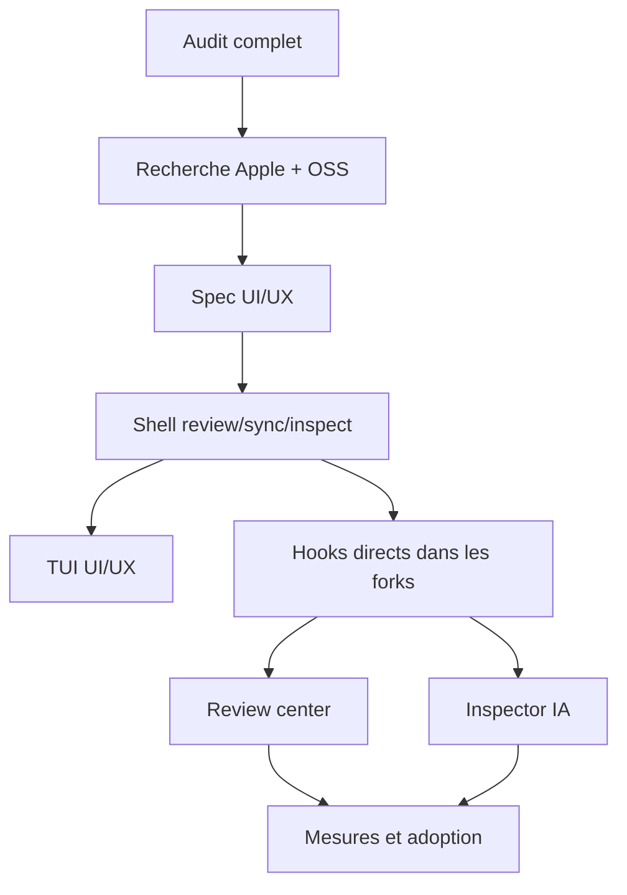

# 20) Plan de refonte UI/UX YiACAD Apple-native

Last updated: 2026-03-21 CET

## Mission

Transformer `YiACAD` en shell CAD IA-native cohérent, lisible et orienté tâches, aligné sur les recommandations Apple officielles disponibles au `2026-03-20`.

## Lots

| Lot | Priorité | Objectif | Sortie attendue |
| --- | --- | --- | --- |
| `T-UX-001` | P0 | audit, recherche et feature map Apple-native | audit, research, feature map, spec |
| `T-UX-002` | P0 | owners, sous-agents et surfaces initiales YiACAD | matrice agents + docs de cadrage |
| `T-UX-003` | P1 | montée native progressive vers les points d’insertion KiCad/FreeCAD documentés | hooks natifs shell/workbench/control |
| `T-UX-004` | P1 | contract `command palette + inspector persistant` dans les surfaces déjà YiACAD | palette légère + inspector/review center alignés |
| `T-UX-005` | P2 | review center consolidé multi-surface | regroupement `ERC/DRC/BOM/sync` |
| `T-UX-006` | P2 | inspector IA contextuel + taxonomie stable | détail, provenance, suggestions |
| `T-UX-007` | P2 | intégration shell compilée profonde | `MainWindow`, `DockWindowManager`, `webview_panel` |
| `T-UX-008` | P3 | App Intents / automatisations locales | trajectoire macOS systemwide |

Note de normalisation:
- la TUI UI/UX reste un runbook support déjà livré;
- elle n’utilise plus l’identifiant canonique `T-UX-003`, réservé aux points d’insertion natifs.

## Agents affectés

| Lead | Sous-agents | Responsabilité |
| --- | --- | --- |
| `UX-Lead` | `Apple-HIG`, `UI-Research` | vision Apple-native, veille officielle, arbitrage UX |
| `CAD-UX` | `KiCad-Surface`, `FreeCAD-Surface` | convergence des surfaces CAD |
| `TUI-Ops` | `Log-Guard`, `Runbook-Doc` | script TUI, logs, purge, runbook |
| `Doc-Research` | `Mermaid-Map`, `README-Align` | docs, diagrammes, feature map, README |

## Affectation de tranche active

| Sous-lot | Owner | Sous-agent | Write-set de tranche |
| --- | --- | --- | --- |
| `T-UX-003A` | `CAD-UX` | `KiCad-Shell` | `.runtime-home/cad-ai-native-forks/kicad-ki/pcbnew/toolbars_pcb_editor.cpp`, `.runtime-home/cad-ai-native-forks/kicad-ki/eeschema/toolbars_sch_editor.cpp` |
| `T-UX-003B` | `CAD-UX` | `FreeCAD-Shell` | `.runtime-home/cad-ai-native-forks/freecad-ki/src/Mod/YiACADWorkbench/yiacad_freecad_gui.py` |
| `T-UX-003C` | `CAD-UX` | `KiCad-Native` | `.runtime-home/cad-ai-native-forks/kicad-ki/pcbnew/tools/board_editor_control.*`, `.runtime-home/cad-ai-native-forks/kicad-ki/eeschema/tools/sch_editor_control.*` |
| `T-UX-003D` | `CAD-UX` | `FreeCAD-Native` | `.runtime-home/cad-ai-native-forks/freecad-ki/src/Gui/MainWindow.cpp` |
| `T-UX-004A` | `CAD-UX` | `KiCad-Surface`, `FreeCAD-Surface` | `.runtime-home/cad-ai-native-forks/kicad-ki/scripting/plugins/yiacad_kicad_plugin/yiacad_action.py`, `.runtime-home/cad-ai-native-forks/freecad-ki/src/Mod/YiACADWorkbench/yiacad_freecad_gui.py` |
| `T-UX-004B` | `Doc-Research` | `Mermaid-Map`, `OSS-Watch` | `docs/YIACAD_*`, `specs/04_tasks.md`, `docs/plans/20_*` |
| `Support UI/UX Ops` | `SyncOps` | `TUI-Ops`, `Log-Guard` | `tools/cockpit/yiacad_uiux_tui.sh`, `artifacts/uiux_tui/*` |

## Plan d’exécution

## Critères d’acceptation

- accès direct à `ERC/DRC`, `BOM Review`, `ECAD/MCAD Sync`, `Status`, `Artifacts`;
- hiérarchie claire des actions primaires et secondaires;
- documentation reliée depuis le README;
- plan, TODO et agent management synchronisés;
- artefacts et logs toujours disponibles pour audit.

## Delta 2026-03-20 16:35 - lot actif

- lot actif: `T-UX-003`
- sous-agents actifs:
  - `KiCad-Native`
  - `FreeCAD-Native`
  - `Doc-Entry`
- objectif de passe: première montée native compilée minimale, sans casser les surfaces Python déjà installées

## Delta 2026-03-20 17:18 - normalisation T-UX

- `T-UX-003` est le canon pour la montée native KiCad/FreeCAD vers les shells documentés.
- `T-UX-004` ouvre d'abord un lot sûr dans les surfaces déjà contrôlées par YiACAD, avant les hotspots compilés `MainWindow`, `DockWindowManager` et `webview_panel`.
- la TUI UI/UX reste un support ops/résilience, découplé de la numérotation produit.

## Delta 2026-03-20 17:18 - lot sûr T-UX-004

- FreeCAD reçoit une palette légère dans le dock `YiACAD Inspector`, avec déclenchement direct des actions natives.
- KiCad reçoit une première `command palette` légère dans le plugin YiACAD natif, sans toucher aux fichiers cœur compilés.
- le `review center` reste un regroupement léger à cette étape; la consolidation profonde reste portée par `T-UX-005`.

## Delta 2026-03-20 18:12 - T-UX-003 shell hooks

- agents dédiés actifs:
  - `CAD-UX / KiCad-Shell`: shell toolbars `pcbnew` + `eeschema`
  - `CAD-UX / FreeCAD-Shell`: prochaine passe `MainWindow` / `DockWindowManager`
  - `Doc-Research / OSS-Watch`: veille officielle KiCad / FreeCAD
- incrément livré:
  - regroupement des actions YiACAD dans un groupe shell `YiACAD Review` côté `pcbnew` et `eeschema`
  - aucune ouverture de write-set sur `eda_base_frame.cpp`, `MainWindow.cpp` ou `DockWindowManager.cpp` à cette passe
- décision:
  - conserver ce lot comme montée shell progressive et garder les hotspots compilés pour une tranche dédiée
  - figer `EDA_BASE_FRAME` en `no-touch` pour `T-UX-003`
  - toute extension shell KiCad doit rester symétrique entre `pcbnew` et `eeschema` tant que le runner reste dupliqué et synchrone
  - garder FreeCAD côté workbench `yiacad_freecad_gui.py` tant que le shell global n’a pas une tranche dédiée; si on monte plus bas, `MainWindow.cpp` est la seule cible admissible au prochain pas

## Delta 2026-03-20 16:55 - résultat de passe

- KiCad: premier point d’entrée natif livré dans `kicad_manager` (`YiACAD Status`).
- FreeCAD: premier inspector dockable livré dans `YiACADWorkbench`.
- Documentation opératoire: points d’entrée et handoffs design raccordés.
- Suivant: étendre `T-UX-003` à `pcbnew` / `eeschema`, puis ouvrir `T-UX-004`.

## Delta 2026-03-20 - T-UX-003 native shells
- Le lot `T-UX-003` atteint maintenant trois surfaces KiCad compilées: `KiCad Manager`, `pcbnew`, `eeschema`.
- La stratégie retenue reste progressive: insertion native dans le shell existant, réutilisation transitoire du bridge `yiacad_ai_bridge.py`, puis remplacement par des hooks backend YiACAD directs.
- FreeCAD dispose déjà du `YiACAD Inspector` dockable côté workbench; la prochaine étape native profonde reste l'ancrage hors simple surface Python.
- Le lot suivant recommandé reste `T-UX-004` pour la `command palette`, l'inspector persistant et la revue contextualisée multi-surface.

## Delta 2026-03-20 - direct hooks over native ops
- Le bridge local `yiacad_ai_bridge.py` n'est plus le chemin cible des surfaces natives principales.
- `KiCad Manager`, `pcbnew`, `eeschema` et le workbench FreeCAD branchent désormais directement `yiacad_native_ops.py`.
- Les quatre actions natives de base sont stabilisées au niveau UI: `Status`, `ERC/DRC`, `BOM Review`, `ECAD/MCAD Sync`.
- Le prochain approfondissement UX doit maintenant porter sur l'orchestration, la persistance et la lisibilité des retours, pas seulement sur le câblage des commandes.

## Delta 2026-03-20 - pivot vers orchestration UX
- L'audit exhaustif est maintenant formalise dans `docs/YIACAD_EXHAUSTIVE_REFOUNTE_AUDIT_2026-03-20.md`.
- Le lot suivant cible explicitement l'orchestration: palette de commandes, review center, inspector persistant, contrats de sortie communs.
- La priorite se deplace du simple `wiring` vers la restitution des resultats, la persistance du contexte et la reduction de la charge cognitive.

## Delta 2026-03-20 18:35 - enchainement plans/todos

- `T-UX-003` est decoupe en sous-lots `A -> D` pour eviter les write-sets croises entre KiCad, FreeCAD workbench et FreeCAD shell global.
- `T-UX-004` est decoupe en sous-lots `A -> B`, avec un lot produit (`palette/inspector`) et un lot doc/contrat (`sortie UX commune`).
- `Support UI/UX Ops` devient une lane explicite, hors numerotation produit, pour piloter plans, preuves, logs et runbook TUI.

## Delta 2026-03-20 18:52 - T-UX-003C helper symmetry

- `T-UX-003C` avance sur le plus petit write-set natif sûr: `pcbnew/tools/board_editor_control.cpp` et `eeschema/tools/sch_editor_control.cpp`.
- Les deux control-layers resolvent maintenant l’interpreteur Python YiACAD via la meme chaine de fallback: settings KiCad, `PYTHON_EXECUTABLE`, puis `python3`.
- `ShowYiacadStatus` passe desormais par le helper canonique des deux cotes, ce qui reduit le drift avant toute insertion native plus profonde.

## Delta 2026-03-20 22:49 - T-UX-004B output contract

- `T-UX-004B` est ferme comme lot doc/contrat.
- Le contrat de sortie UX commun YiACAD est publie avec une doc lisible, un schema JSON et un exemple machine-readable.
- La TUI YiACAD expose maintenant ce contrat dans `proofs`, pour garder la lane auditable sans lecture implicite des specs.

## Consolidation canonique 2026-03-20

- `T-UX-003`:
  - essentiellement livre sur `KiCad Manager`, `pcbnew`, `eeschema`
  - FreeCAD est stable au niveau `YiACADWorkbench`, avec un reste d'ancrage shell plus profond hors de ce palier
  - le chemin principal appelle maintenant `yiacad_native_ops.py`
- `T-UX-004`:
  - ouvert et structure
  - `T-UX-004B` ferme
  - reste a executer: palette unifiee, `review center`, inspector persistant et lecture du contexte projet
- Priorite UI/UX immediate:
  - reduire la charge cognitive
  - rendre les resultats lisibles sans lecture manuelle des artefacts
  - garder un fallback non-IA clair et auditable
- Dependance architecture immediate:
  - `T-UX-004` doit maintenant consommer le backend local YiACAD (`context.json` + `uiux_output.json`) plutot qu'un simple retour texte de CLI

## Delta 2026-03-20 23:06 - T-UX-003D shell anchor

- `T-UX-003D` avance via `freecad-ki/src/Gui/MainWindow.cpp` seul.
- Un dock shell compile `Std_YiACADShellView` est cree dans `MainWindow`, cache par defaut et reserve comme ancrage stable pour la convergence future du shell YiACAD.
- `DockWindowManager.cpp` et `ComboView.cpp` restent hors write-set; le workbench Python conserve l’autorite produit tant que le contrat shell profond n’est pas complet.

## Delta 2026-03-20 23:22 - T-UX-003D shell card scaffold

- Le dock `Std_YiACADShellView` expose maintenant les rubriques du contrat de sortie YiACAD (`surface`, `status`, `severity`, `summary`, `artifacts`, `next_steps`).
- Le shell FreeCAD dispose donc d’une première lecture produit du contrat, sans dépendre encore d’un backend temps réel ni d’un dock manager custom.
- `T-UX-003D` est considéré comme atteint pour la phase de préparation shell via `MainWindow.cpp` seul.

## Delta 2026-03-21 - T-UX-004A + operator index
- `T-UX-004A` est effectivement livre sur les surfaces deja controlees par YiACAD.
- KiCad plugin et FreeCAD workbench consomment maintenant le contrat backend JSON pour la palette legere et le review center leger.
- l'entree operateur cross-lanes devient `yiacad_operator_index.sh`, tandis que `yiacad_uiux_tui.sh` reste la lane produit.

## Delta 2026-03-21 - T-UX-005 delivered
- le review center est maintenant enrichi sur KiCad plugin et FreeCAD workbench.
- la presentation est structuree par sections et met mieux en avant le contexte projet, les artefacts et les prochaines actions.
- le prochain focus UX devient la persistance de l'inspector et de la session de revue.

## Delta 2026-03-21 - preuve backend UI/UX

- la lane UI/UX dispose maintenant d'une preuve operateur canonique via:
  - `bash tools/cockpit/yiacad_backend_proof.sh --action run`
- cette preuve complete la TUI UI/UX sans ouvrir de GUI:
  - KiCad helper -> facade backend -> `uiux_output`
  - FreeCAD helper -> facade backend -> `uiux_output`
- le prochain front UX ne porte plus sur le simple transport, mais sur la persistance de l'inspector et de la session de revue.

## Delta 2026-03-21 - T-UX-006A session persistante

- premiere tranche produit de `T-UX-006` executee sur le plus petit write-set Python utile:
  - plugin KiCad: restauration et persistance de la derniere session de revue
  - workbench FreeCAD: persistance/rechargement de la meme session de revue
- la session canonique est maintenant lisible sans GUI via:
  - `bash tools/cockpit/yiacad_uiux_tui.sh --action review-session`
- les docks compiles profonds restent hors write-set a cette passe.

## Delta 2026-03-21 - T-UX-006B historique et taxonomie

- deuxieme tranche produit de `T-UX-006` executee sans ouvrir les hotspots compiles:
  - l'historique de revue est maintenant persiste dans `artifacts/cad-ai-native/review_history.json`
  - une taxonomie legere classe les actions en `review`, `analysis`, `sync`, `status`, `artifacts`
  - l'historique est lisible via `yiacad_uiux_tui.sh` et `yiacad_operator_index.sh`
- le prochain front UX devient l'enrichissement visuel/contextuel de l'inspector, pas la simple retention des payloads.

## Delta 2026-03-21 - T-UX-006C vue operateur

- une vue operateur lisible de la taxonomie de revue est maintenant disponible:
  - `bash tools/cockpit/yiacad_uiux_tui.sh --action review-taxonomy`
  - `bash tools/cockpit/yiacad_operator_index.sh --action review-taxonomy`
- cette tranche ferme le passage de l'historique brut a une lecture exploitable par l'operateur.

## Delta 2026-03-21 - T-UX-006 delivered
- KiCad plugin:
  - bandeau de session persistant
  - reprise du dernier contexte et du dernier contrat
- FreeCAD workbench:
  - en-tete de session persistant
  - trajet recent et continuite visuelle entre actions
- le prochain focus UX ne porte plus sur la persistance de base, mais sur une session de revue plus riche et plus durable.

## Delta 2026-03-21 - T-ARCH-101C impact UI/UX
- les surfaces Python YiACAD actives passent maintenant par un client backend `service-first`.
- le fallback direct reste conserve pour ne pas casser les surfaces deja livrées.
- cette base permet de faire evoluer l'UX sans continuer a empiler de la logique d'appel direct dans chaque surface.

## Delta 2026-03-21 - T-UX-006D contexte compact
- une tranche compacte de la session riche est maintenant livree sans ouvrir les hotspots compiles:
  - KiCad expose un contexte de revue recent enrichi de taxonomie et des dernieres actions
  - FreeCAD affiche un trail enrichi avec synthese de taxonomie
  - la TUI et l'index operateur exposent `review-context` comme vue courte consolidee
- le prochain front UX ne porte plus sur la visibilite brute de l'historique, mais sur l'eventuel enrichissement multi-vues ou la propagation vers les shells compiles quand le write-set sera acceptable.

## Delta 2026-03-21 - T-UX-006E contexte de preuve utile
- le builder de contexte YiACAD calcule maintenant un `context_ref` deterministe a partir du chemin demande, meme si la preuve utilise encore un fichier absent.
- la vue `review-context` reste donc metierement honnete (`blocked`) mais n'affiche plus un contexte vide en tete.
- cette tranche referme le residuel operateur le plus visible sans ouvrir le blocage runtime externe `yiacad-fusion`.

## Delta 2026-03-21 - T-UX-006F fixtures de preuve stables
- la preuve backend YiACAD bascule sur des fixtures suivies dans le repo pour fiabiliser le contexte recent.
- le prochain front UX ne porte donc plus sur des chemins temporaires ou ambigus, mais sur un contexte de preuve reproductible et versionne.

## Delta 2026-03-21 - T-UX-006D contexte de revue

- une nouvelle tranche produit dérivée de `T-UX-006` expose un contexte de revue synthétique dans les surfaces YiACAD déjà contrôlées:
  - session courante
  - taxonomie récente
  - trail récent
  - prochaines étapes dédupliquées
- write-set ciblé:
  - `.runtime-home/cad-ai-native-forks/kicad-ki/scripting/plugins/yiacad_kicad_plugin/yiacad_action.py`
  - `.runtime-home/cad-ai-native-forks/freecad-ki/src/Mod/YiACADWorkbench/yiacad_freecad_gui.py`
  - `tools/cockpit/yiacad_uiux_tui.sh`
  - `tools/cockpit/yiacad_operator_index.sh`

## 2026-03-21 - Lot update
- `T-ARCH-101C` etendu: les surfaces KiCad compilees passent en `service-first` via `tools/cad/yiacad_backend_client.py`, avec auto-start du service local et fallback direct vers `tools/cad/yiacad_native_ops.py`.
- `T-OPS-119` consolide: `tools/cockpit/yiacad_operator_index.sh` devient l'entree operateur stable avec `status`, `uiux`, `global`, `backend`, `proofs` et des alias de compatibilite conserves.
- Risque residuel: aucune validation d'execution n'a ete lancee; l'extension aux call sites compiles restants doit etre traitee dans un lot separe.

## 2026-03-21 - Proofs lane
- Nouveau point d'entree: `bash tools/cockpit/yiacad_proofs_tui.sh --action status`.
- Objectif: centraliser `backend`, `review-session`, `review-history`, `review-taxonomy` et l'hygiene des logs dans une surface canonique sans casser les alias historiques.
- Documentation: `docs/YIACAD_PROOFS_TUI_2026-03-21.md`.

## Delta 2026-03-21 - closure T-UX-003 / T-UX-004
- `T-UX-003` est ferme comme lot parent:
  - `kicad_manager`, `pcbnew`, `eeschema` et `YiACADWorkbench` portent les surfaces natives utiles
  - `MainWindow.cpp` expose l'ancrage shell compile `Std_YiACADShellView`
  - `test/test_yiacad_native_surface_contract.py` verrouille ce contrat de presence
- `T-UX-004` est ferme comme lot parent:
  - plugin KiCad et workbench FreeCAD exposent `Command Palette`, `Review Center`, session persistante et contexte recent
  - la surface produit canonique reste volontairement Python-first tant que les hotspots shell profonds ne sont pas priorises
- les suites profondes se deplacent vers `T-UX-007`; elles ne rouvrent plus `T-UX-003` ni `T-UX-004`.
