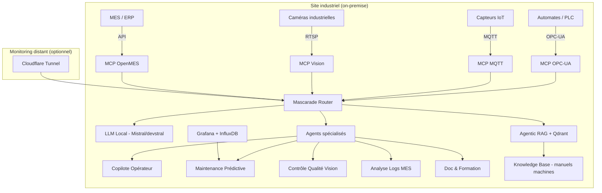

# Plan 27 — Factory 4.0 : MCP OPC-UA/MQTT + IA industrielle

## Contexte

L'Electron Rare propose des services d'intégration IA en milieu industriel (Factory 4.0) basés sur une stack 100% open source déployable on-premise. Ce plan couvre la création des briques techniques manquantes et le packaging commercial.

## Architecture cible

## Lanes

| Lane | Owner | Priorité |
|------|-------|----------|
| MCP OPC-UA server | firmware-agent | P0 |
| MCP MQTT server | firmware-agent | P0 |
| MCP Vision (RTSP/YOLO) | qa-agent | P1 |
| MCP OpenMES/Odoo connector | pm-agent | P1 |
| Agents industriels (copilote, prédictif, qualité) | architect-agent | P0 |
| Pipeline maintenance prédictive (PatchTST + InfluxDB) | doc-agent | P1 |
| Documentation commerciale + offres | pm-agent | P0 |
| Démo on-premise packagée (Docker Compose) | firmware-agent | P1 |

## Offres commerciales

### Starter — Copilote Opérateur (5-10j)
- Mascarade + Ollama local + RAG docs machines
- 1 LLM (Mistral/devstral), 1 base documentaire
- Chatbot opérateur multilingue (FR/EN/DE)
- Souveraineté données (RGPD)

### Pro — Factory Intelligence (15-25j)
- Starter + maintenance prédictive (PatchTST + InfluxDB + Grafana)
- Analyse logs MES/ERP automatisée
- MCP OPC-UA + MQTT connectés aux machines
- Dashboards temps réel

### Enterprise — Full Factory 4.0 (30-50j)
- Pro + vision industrielle (YOLOv8/SAM2 sur Jetson)
- Intégration MES/Node-RED/SCADA
- Formation opérateurs générée automatiquement
- Support + maintenance annuel

## Dépendances

- Mascarade core (OK — 5 machines, 24 agents, Agentic RAG)
- Fake Ollama (OK — compatible tout frontend)
- Qdrant (OK — Tower, 3 collections)
- Grafana + Prometheus (OK — Tower monitoring stack)
